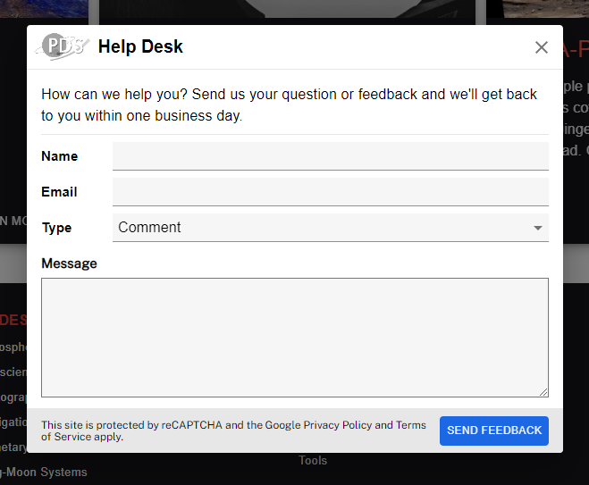
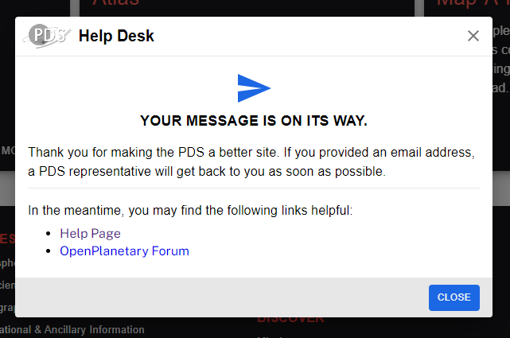

# PDS Feedback Modal

Captures user questions and feedback and submits them to https://pds.nasa.gov/email-service/SubmitFeedback.

- This is the React and Material UI version and the original can be found at [here](https://github.com/NASA-PDS/feedback-widget)
- This version is a standalone version that does not need all the pds-wds code to work. React + Material UI are its only dependencies.
  - Developed with `"react": "^16.13.1"` and `"@material-ui/core": "^4.11.0"`
- This is only the modal component. You are responsible for the trigger to open it.
- reCaptcha is partially implemented but ultimately ignored.
- More configurability may need to be added.

## How To Use The PDS App Bar

1. Add Feedback.js to your project.
1. Import the component with `import Feedback from './{path_to}/Feedback'`
1. Add it to a render function:

```javascript
import Feedback from "./Feedback";
import logo from "../media/images/pdsLogo.png";

const YourComponent = () => {
  // ...
  return (
    <Feedback
      open={open} // boolean
      handleClose={handleClose} // close callback (for setting open = false)
      links={[
        { name: "Help Page", link: "/help" },
        { name: "OP Forum", link: "https://forum.openplanetary.org" },
      ]}
      logoUrl={logo} // a logo for the header
    />
  );
};
```

### Unused props:

```javascript
site_key = { reCaptchaSiteKey }; // needs work / don't use
verify = { verify }; // needs work / don't use
```

## Images

The Feedback modal has a submitted and not submitted state.

### Before Submission:



### After Submission:


